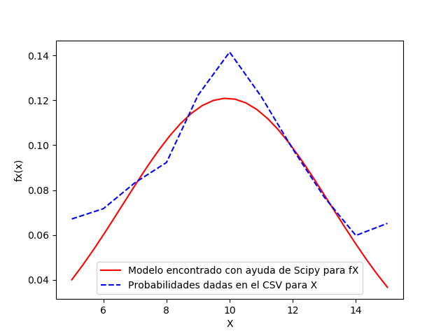
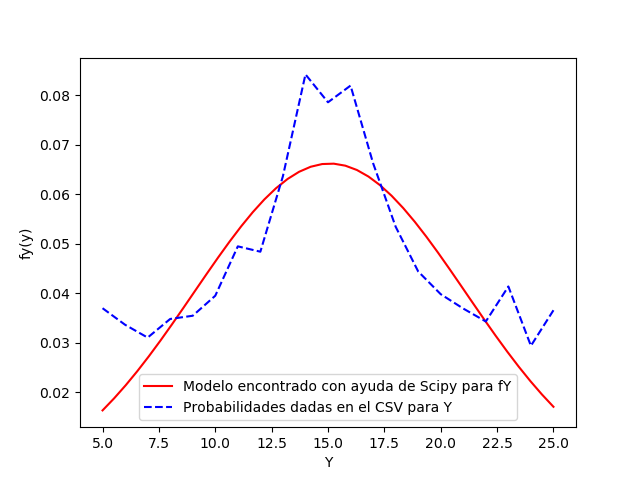
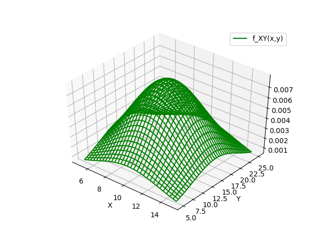
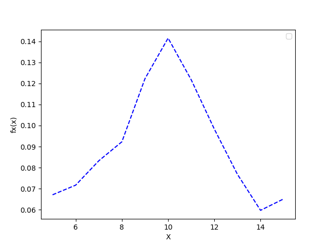
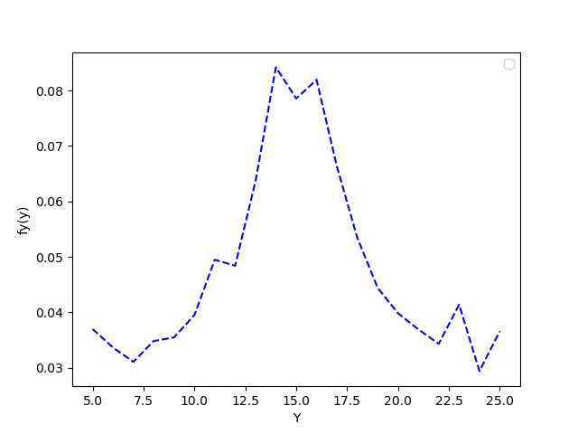
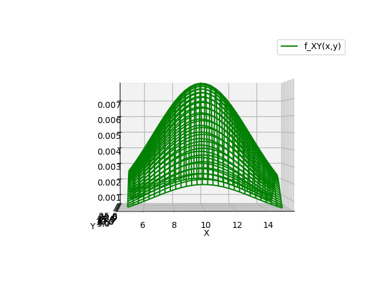

# Respuestas Tarea 3 del curso IE0405
Estudiante: Mauricio Céspedes Tenorio - B71986

1. A partir de los datos, encontrar la mejor curva de ajuste (modelo probabilístico) para las funciones de densidad marginales de X y Y.  
R\ Primero se leyó el archivo xy.csv con ayuda de <em>np.genfromtxt()</em>. Luego, se encuentraron las funciones de densidad marginal de X y Y al sumar todos los Y para cada valor de X y al sumar los X para cada Y respectivamente de los datos dados en el CSV. Al graficar estos valores, se observó una tendencia Gaussiana en ambas variables aleatorias, por lo que se creó una función Gaussiana que recibe como parámetros la variable aleatoria, la media (mu) y desviación estándar (sigma). Con ayuda del comando de SpiPy <em>curve_fit()</em>, se obtuvieron los parámetros <em>mu</em> y <em>sigma</em> de mejor ajuste para ambas PDF marginales. Las funciones fueron graficadas con ayuda de Matplotlib y se notó que no modelaban perfectamente los datos, pero esto es esperable al tener ruido. Las imágenes obtenidas se muestran a continuación:  

  
   
  Figura 1. Curva de mejor ajuste obtenida para la función de densidad marginal de X.

  

    
   
  Figura 2. Curva de mejor ajuste obtenida para la función de densidad marginal de Y.

  
2. Asumir independencia de X y Y, ¿cuál es entonces la función de densidad conjunta que modela los datos?  

R\ Al asumir independencia, se tiene que la función de densidad conjunta de X y Y está dada por la multiplicación de las funciones densidad marginales de X y Y. A partir de esto, se creó una función en Python que recibe como parámetros las <em>x</em> y <em>y</em> y devuelve la multiplicación de la función Gaussiana de cada una de ellas con la media y desviación estándar obtenidas en el punto 1 para cada una de las variables aleatorias. Se graficó una PDF conjunta de mejor ajuste en 3D para compararla con la discreta que se obtiene en el punto 4.  
$f_{XY}(x,y)=f_X(x)*f_y(Y)$   

  
   
  Figura 3. Vista completa de la función de densidad conjunta modelada.

  

3. Hallar los valores de correlación, covarianza y coeficiente de correlación (Pearson) para los datos y explicar su significado.  

R\ Para este punto, primero se guardó en un array los datos datos en el archivo xyp.csv mediante el comando <em>np.genfromtxt()</em>. Luego, se calculó la covarianza y la correlación mediante un <em>for</em>.  
-Para la correlación se obtuvo un valor de 149.543, que es muy similar al encontrado mediante la multiplicación de E[X] y E[Y] (obtenidos con los <em>mu</em> del punto 1), con lo que se concluyó que las variables aleatorias X y Y no están correlacionadas.  
-Para la covarianza, se encontró un valor de 0.067, que es aproximadamente cero. Por ende, se puede concluir que X y Y no están correlacionadas (corroborando lo encontrado con la correlación) y que son independientes.  
-El coeficiente de correlación, se calculó como la covarianza entre la multiplicación de las desviaciones estándar encontradas para X y Y en el punto 1. Como la covarianza ya era muy cercana a cero, se esperaba que este coeficiente también lo fuera, y esto fue lo obtenido, con un valor de 0.003. Esto reafirma lo encontrado con la covarianza.  

4. Graficar las funciones de densidad marginales (2D), la función de densidad conjunta (3D).  

Como último punto, se graficaron los modelos de las funciones de densidad marginales en 2D y la de densidad conjunta en 3D con ayuda de Matplotlib. Estas se muestran a continuación:

  
   
  Figura 4. Función de densidad marginal de X.

  

  
   
  Figura 5. Función de densidad marginal de Y.

  

  
   
  Figura 6. Vista completa de la función de densidad conjunta modelada.

  

  
   
  Figura 7. Vista lateral 1 de la función de densidad conjunta modelada.

  

  
   
  Figura 8. Vista lateral 2 de la función de densidad conjunta modelada.

  
